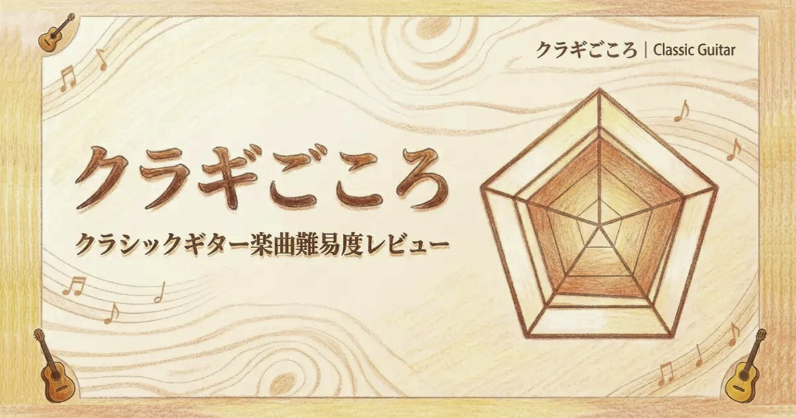
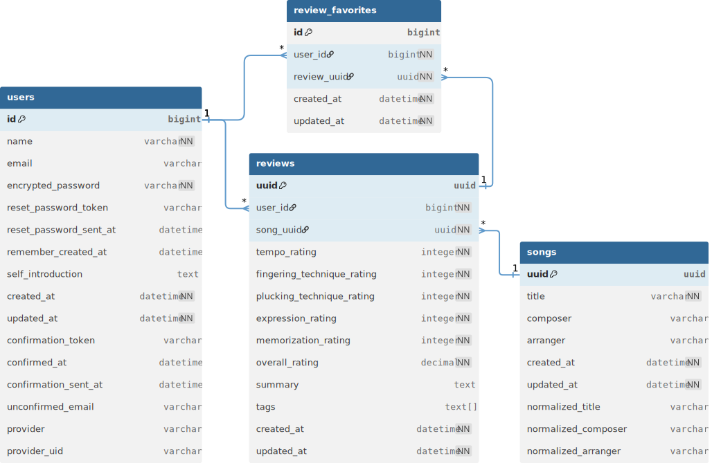

# クラギごころ

**サービスURL：https://clagi-gokoro.com**

**デモアカウント**

- **ログインID（ニックネーム）**：デモユーザー
- **パスワード**：clagigokoro

## サービス概要

クラシックギター曲の難易度を5つの観点で多角的に可視化できるWebサービスです。
各曲は「テンポ」「運指」「表現力」などの項目を星評価で入力し、レーダーチャートとして表示されます。
まだ知られていない曲にも出会いながら、他の演奏者の感じ方を共有・比較できます。

## このサービスへの思い・作りたい理由

学生時代、クラシックギターでソロギターを弾いていました。
しかし、次に弾く曲を選ぶとき、いつも「どれくらい難しいんだろう？」「自分にも弾けるかな？」と悩んでいました。
クラシックギターを弾く中で、曲の難易度を事前に知る手段がほとんどないと感じていたからです。

同じ曲でも「テンポが速くて苦手」「左手の運指が複雑」「右手のバランスが取りにくい」と感じるポイントは人それぞれです。
その多様な体感を共有できる場所があれば、より多くの人が自分に合った曲を見つけられるのではないかと思いました。

また、クラシックギターの世界は名曲が多い一方で、知られていない良曲も数多く存在します。
このサービスを通じて、曲との新しい出会いや発見が生まれればと考えています。

## ユーザー層について

- クラシックギターを演奏している方
- これからクラシックギターを始めようとしている方

演奏経験の有無にかかわらず、「どんな曲から挑戦すればいいか分からない」「自分に合った難易度を知りたい」と感じている人を主な対象としています。

## サービスの利用イメージ

1. ユーザーは気になる曲を検索・追加し、各項目を星評価で入力します。
2. 評価はレーダーチャートで視覚化され、他のユーザーの評価を確認することも可能です。
3. 自由記述のコメントで「ここが難しい」「ここが気持ちいい」といった感想も共有できます。

### 評価項目

|項目名|説明|
| --- | --- |
|テンポ|曲の速さやリズムの取りやすさ、安定したテンポ維持の難易度|
|運指技巧|ポジション移動や押弦の複雑さ|
|弾弦技巧|弦を弾く手の技術。アルペジオ、弦間移動、タッチコントロールなどの難易度|
|表現力|フレーズ全体の抑揚、音色変化、感情表現など、音楽的解釈の難しさ|
|暗譜・構成|曲の構造を把握し、暗譜して通して演奏するまでの難易度|

## サービスの差別化ポイント・推しポイント

### 既存の難易度情報の限界

現状、クラシックギターの楽曲難易度を多角的に評価・共有できるWebサービスは存在しないかと思われます。
そのため、演奏者は主にグレード本やブログ、演奏動画のコメントなどを参考にしていますが、
これらの情報は評価基準が統一されておらず、個々の感覚に依存しやすい傾向があります。
結果として、曲同士を客観的に比較したり、自分に合った曲を選ぶことが難しい状況です。

#### グレード本（A/B/C等）

- 「グレードA（初級）」「グレードB（中級）」といった総合難易度は分かるが、具体的な理由が不明
- 同じグレードA内でも「テンポ重視」「運指重視」など特徴が様々で個人差を考慮できない
- 「なぜその難易度なのか」が分からず、自分の得意・苦手分野との照らし合わせが困難

#### その他の情報源

- ブログ記事や演奏動画のコメント：「難しい」「簡単」など抽象的な表現のみ
- 情報が個人の中に留まりやすく、統一された評価軸で体系的に比較・分析することは困難

### このサービスの独自価値

#### 1. 多次元評価による感覚の可視化

従来：「この曲はグレードA（初級）」

本サービス：「テンポ★★★☆☆、運指技巧★★★★★、弾弦技巧★★★★☆、表現力★★★☆☆、暗譜・構成★★★★☆」

- 5軸のレーダーチャートで曲の特徴や難しさの傾向を視覚的に把握
- 「運指は得意だけどテンポが苦手」な人に最適な曲選びが可能

#### 2. データに基づいた楽曲発見のサポート

従来：偶然の出会いや知人の紹介頼み

本サービス：蓄積された評価データから自分で発見

- 既存の大まかなグレード分類を、より細やかな個人視点の評価へと発展
- 偶然ではなく、データに基づいた自分に合う曲との出会いをサポート

#### 3. 詳細な評価情報の共有

- グレード分類では得られない「なぜその評価なのか」が分かる
- 「この部分が難しい」「ここの表現が好き」などの具体的な感想を確認できる
- 一人練習が多いクラシックギター界に客観的な情報を提供

## 機能一覧

### 認証機能

- ユーザー登録・ログイン機能（ニックネーム / パスワード）
- Google認証
- メールアドレス登録・認証（任意、パスワードリセット時に必要）
- パスワードリセット

### 曲管理

- 新規追加（重複チェック付き）
- 検索機能
- 一覧表示

### レビュー機能

- 星評価・コメントによる投稿
- レーダーチャート表示
- タグ付け
- お気に入り登録
- X（Twitter）シェア

## 使用技術スタック

|カテゴリ|技術内容|
| --- | --- |
|サーバーサイド|Ruby 3.3.6 / Ruby on Rails 7.2.2|
|フロントエンド|TailwindCSS / daisyUI / Hotwire|
|データベース|PostgreSQL|
|認証|devise / omniauth-google-oauth2|
|グラフ作成|Chart.js|
|タグ付け|Tagify|
|開発環境|Docker|
|本番環境|Render / Neon|

その他の使用Gem

- kaminari（ページネーション）
- draper（デコレーター）
- gretel（パンくずリスト）
- rails-i18n / devise-i18n（国際化）
- dotenv-rails（環境変数管理）
- inline_svg（SVG表示）
- meta-tags（メタタグ管理）

## 画面遷移図

[Figma画面遷移図](https://www.figma.com/design/qVmGomC2VVMsr2hfnn5Q9U/clagi-gokoro?m=auto&t=CDy97zOKIwAHEPGv-1)

## ER図

- 詳細は、[dbdiagramファイル](dbdiagram)で確認できます
